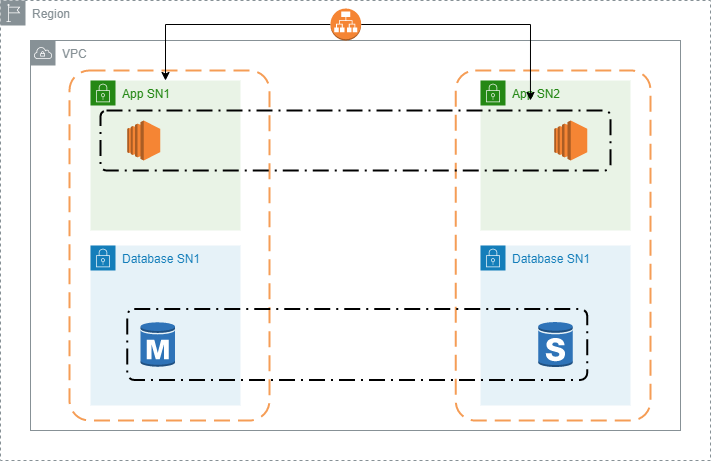

# grafana-cfn-deployment
This is a complete Grafana deployment in a single Cloudformation template.
It runs Grafana on a high availabilty setup and has two environment options: developement and production. 
It was written as an excercise on Cloudformation, but I believe it can be used in real world scenarios.

The picture below roughly describes the infrastructure created by this template.



### Parameters

| Parameter Name | Description |
| ------ | ------ |
| Type of deployment | Choose between dev and prod. Differences on EC2 and RDS families and sizes.|
| User IP | Your IP on CIDR format. This applies only to port 22, so use your own IP. |
| UserKeyPair | A keypair to allow ssh connection. |
| DatabasePassword | The database master password. |

### How to use this template

* **Via AWS Console:** 
    - Type _Cloudformation_ in the search bar on the top of the console screen.
    - Upload the _yml_ file on the bottom of the screen, on the _Specify Template_ section. Click the _Next_ button.
    - Type a name for the deployment, fill the parameters as desired. Click the _Next_ button.

* **Via AWS Cli**:
    - Type the following command: <br>
    ```aws cloudformation deploy --template-file grafana-deployment.yml --stack-name \<stack-name\> --parameter-overrides EnvironmentType=\<environment type\> UserIp=\<your ip in CIDR format\> UserKeyPair=\<an existing key pair\> DatabasePassword=\<db password\>```
    - Please note that your user must have the permissions for running the template, as well as creating all the resources needed.